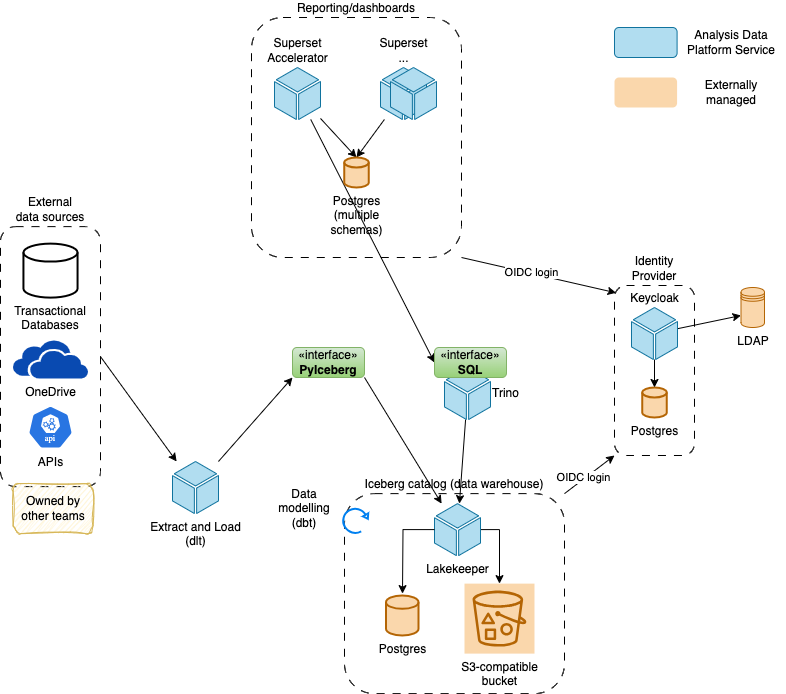

# System Architecture

The following sections describe the high-level services and how they connect with each other.
See [deployment docs](../deployment/index.md) on how this is deployed on the STFC cloud.

## Overview

Externally managed Postgres instances are provided by the SCD Database Services team. S3-compatible
object storage is provided by the SCD Ceph team.

## Services

Here we provide an overview of the key services. For details on their deployment configuration
see [deployment](../deployment/index.md).

### Keycloak

[Keycloak](https://keycloak.org) provides identity for the platform. It acts as an OIDC/OAuth2 provider
for single-sign-on, providing a consistent view of a user across multiple services, for example
Lakekeeper & Superset.

### Lakekeeper

[Lakekeeper](https://docs.lakekeeper.io) implements the catalog and table management layer used by
Iceberg tables. It provides metadata APIs, coordinates table lifecycles, stores catalog metadata in a persistent metadata database and uses the object store for table data.
Other services (Trino, batch jobs) use the Lakekeeper catalog to discover and
manipulate Iceberg tables.

### Trino

[Trino](https://trino.io) is the distributed SQL query engine used querying Iceberg tables.
A Trino coordinator and workers execute queries against the Lakehouse using the Iceberg connector
and the Lakekeeper catalog. Trino is the primary compute engine for BI workloads and SQL-based
exploration within Superset.

### Superset

[Superset](https://superset.apache.org) is the business intelligence and visualization layer.
It connects to Trino, provides dashboards, charts and exploration tools, and relies
on central authentication (Keycloak) for SSO.

## Tools

The platform uses a small set of data engineering tools to build, orchestrate
and test ELT pipelines. Two of the primary packages are described below.

### dlt

[dlt](https://dlthub.com/docs/intro) provides an extraction and loading framework for the
ELT pipelines. It provides connectors for common sources, schema management, and
incremental loading semantics.

### dbt

[dbt](https://docs.getdbt.com) is used for transforming and modelling tabular data in
the `silver` and `gold` layers. `dbt` enables SQL-based transformations, version-controlled models,
testing, documentation, and dependency graphs for data products.

### elt-common

[elt-common](../../elt-common) is our own Python package that provides additional functionality
built on top of [dlt](#dlt). It is not published to PyPI and must be installed using the git source
url.
